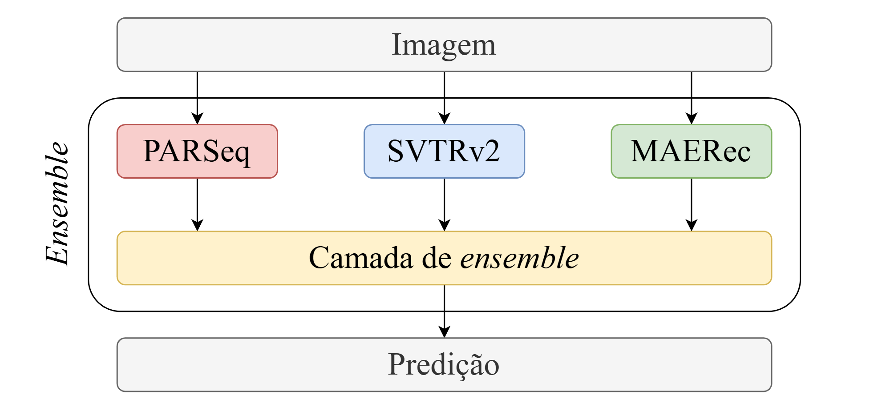
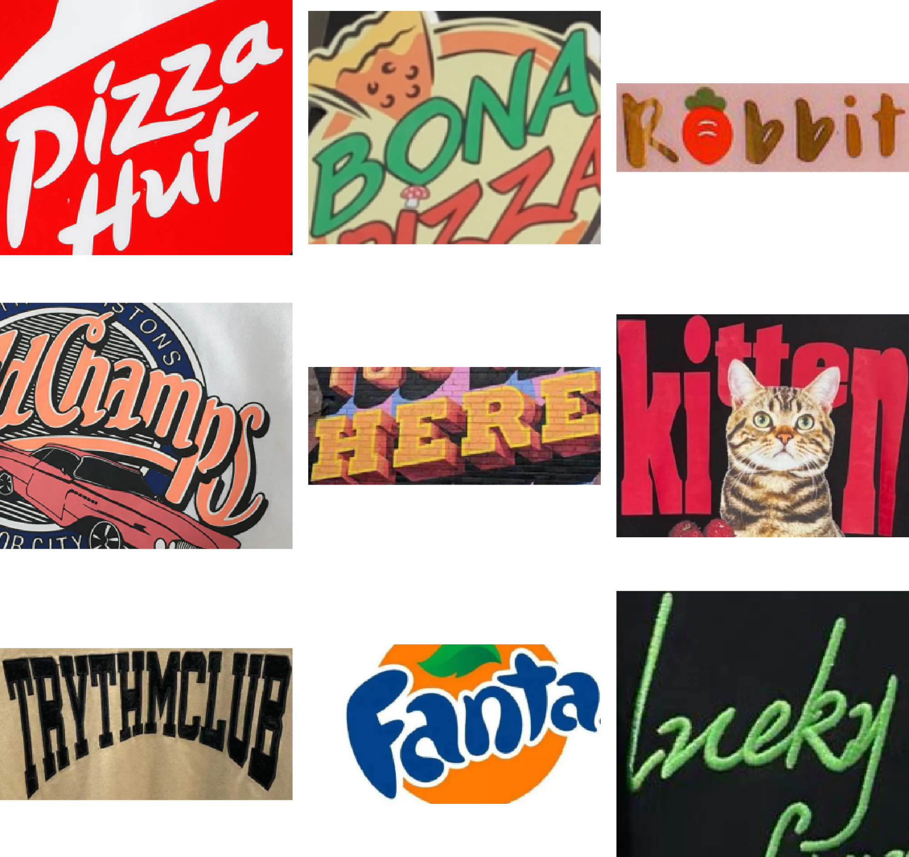

# Avaliando Abordagens do Estado da Arte para Reconhecimento de Textos Artísticos

*Evaluating State-of-the-Art Approaches to Artistic Text Recognition*

**ICDAR 2024 Competition on Artistic Text Recognition**

<picture>
    <source
        srcset="https://raw.githubusercontent.com/lucas-azdias/PUCPR-SVG/ea4f6a6f371fa7c4b26b84b4ad8e00db2b830b9b/branco/pucpr-completa.svg"
        media="(prefers-color-scheme: dark)"
        height="80px"
    />
    <source
        srcset="https://raw.githubusercontent.com/lucas-azdias/PUCPR-SVG/ea4f6a6f371fa7c4b26b84b4ad8e00db2b830b9b/cor-primaria/pucpr-completa.svg"
        media="(prefers-color-scheme: light), (prefers-color-scheme: no-preference)"
        height="80px"
    />
    
</picture>

---

    [Modelos](#modelos) | [Dataset](#dataset) | [Primeiros passos](#primeiros-passos) | [Artefatos](#artefatos) | [Artigo](#artigo)

 

    <picture>
        
    </picture>

---

## Integrantes (Team)

- Lucas Azevedo Dias
- Henrique Anderle Schulz
- Rafaela de Miranda
- Guilherme Henrique Eduardo de Lara Peres
- Pedro Lucas Ghezzi Bittencourt

## Overview

The article addresses the challenge of Artistic Text Recognition (ATR), a complex field within computer vision that aims to interpret highly stylized text — characterized by distortions, variations in color, shape, and typography — commonly found in posters, covers, and other visual designs.

**The main goal of this work is to explore the current state of the art in ATR and to develop a customized, competitive solution** comparable to those presented at the **ICDAR 2024** competition, contributing to the advancement of text recognition techniques in artistic contexts.

Experiments conducted on Google Colab with an L4 GPU demonstrated that the proposed approach achieved **89.90% accuracy (WRA)** on the final test set of the **WordArt-V1.5** dataset, a performance that would place it among the top three solutions in the **ICDAR 2024** competition.

## Visão Geral

O artigo aborda o desafio do reconhecimento de textos artísticos (ATR), uma área complexa da visão computacional que busca interpretar textos altamente estilizados — com distorções, variações de cor, forma e tipografia — frequentemente encontrados em pôsteres, capas e criações visuais.

**O objetivo principal do trabalho é explorar o estado do conhecimento atual sobre ATR e desenvolver uma solução customizada competitiva** com as apresentadas na competição **ICDAR 2024**, contribuindo para o avanço das técnicas de reconhecimento de textos em contextos artísticos.

Os experimentos, realizados no Google Colab com GPU L4, mostraram que a abordagem alcançou **89,90% de acurácia (WRA)** no conjunto de teste final do dataset **WordArt-V1.5**, desempenho que a colocaria entre as três melhores soluções da competição **ICDAR 2024**.

## ICDAR 2024
- [Competição](https://sites.google.com/view/icdar-2024-competition-wordart/)
- [Resultados da competição](https://codalab.lisn.upsaclay.fr/competitions/17182#results)

## Dataset

    <picture>
        
    </picture>

O dataset **WordArt-V1.5** disponibilizado pela competição foi compilado e foi utilizado para o treinamento, validação e teste dos modelos.

| Dataset | Descrição | Link |
|:--|:--|:--|
| **Compilado** | Versão consolidada do WordArt-V1.5, incluindo todas imagens e anotações. | [GitHub](https://github.com/lucas-azdias/WordArt-V1.5-Dataset) |
| **Treino** | Conjunto utilizado para treinamento dos modelos. | [Download](https://drive.google.com/file/d/1Lq6xKNbD7Kvs-i1myJPmwBLLG5YnoM9N/view) |
| **Teste A (Validação)** | Subconjunto destinado à validação e ajuste de hiperparâmetros. | [Download](https://drive.google.com/file/d/15tkLbdXYzIILVWIg4kqjPMJ51p-vD2Ej/view) |
| **Teste B (Competição)** | Conjunto final de teste, usado para avaliação oficial na competição. | [Download](https://drive.google.com/file/d/1Q7kAqFITGntZAn-HuCh8vQpHTpDkPSAH/view) |

## Modelos

Os modelos abaixo foram os selecionados para a etapa de fusão por apresentarem arquiteturas representativas do estado da arte e ótimos resultados de desempenho e de generalização sobre o dataset **WordArt-V1.5**.

Em especial, foram escolhidos por cobrirem diferentes paradigmas de reconhecimento de texto --- abordagens baseadas em transformador de visão (ViT) com _decoder_ visual-linguístico (**PARSeq**), em classificação temporal conexionista (CTC) com uso de módulos (**SVTRv2**) e pré-treinamento autossupervisionado com _autoencoder_ com máscaras (**MAERec**). Essa diversidade favorece a complementaridade de predições na etapa de fusão.

| Modelo | Código-Fonte | Publicação |
|:--|:--|:--|
| **PARSeq** | [GitHub](https://github.com/baudm/parseq) | [ArXiv](https://arxiv.org/pdf/2207.06966) |
| **SVTRv2** | [GitHub](https://github.com/Topdu/OpenOCR/blob/main/configs/rec/svtrv2/readme.md) | [ArXiv](https://arxiv.org/pdf/2411.15858) |
| **MAERec** | [GitHub](https://github.com/Mountchicken/Union14M/tree/main?tab=readme-ov-file#5-maerec) | [ArXiv](https://arxiv.org/pdf/2307.08723) |

Os pesos com ajuste fino dos modelos estão disponíveis [aqui](https://mega.nz/folder/JZIyma4I#VbFauSW6ilS7n0ON9A3PQA).

## Outros modelos

Outros modelos de reconhecimento de texto foram avaliados durante os experimentos preliminares.
Contudo, foram descartados para a etapa de fusão final devido a baixa complementaridade de predições, assim não contribuindo significativamente para o ganho de desempenho no _ensemble_.

| Método | Código-Fonte | Publicação |
|:--|:--|:--|
| **ViTSTR** | [GitHub](https://github.com/kwon-evan/ViTSTR) | [ArXiv](https://arxiv.org/pdf/2105.08582) |
| **CornerTransformer** | [GitHub](https://github.com/xdxie/WordArt) | [ArXiv](https://arxiv.org/pdf/2208.00438) |

## Artefatos

...

## Manuscritos

...

## Primeiros passos

...
