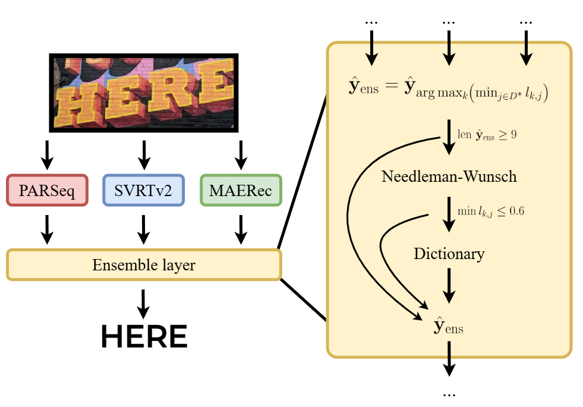
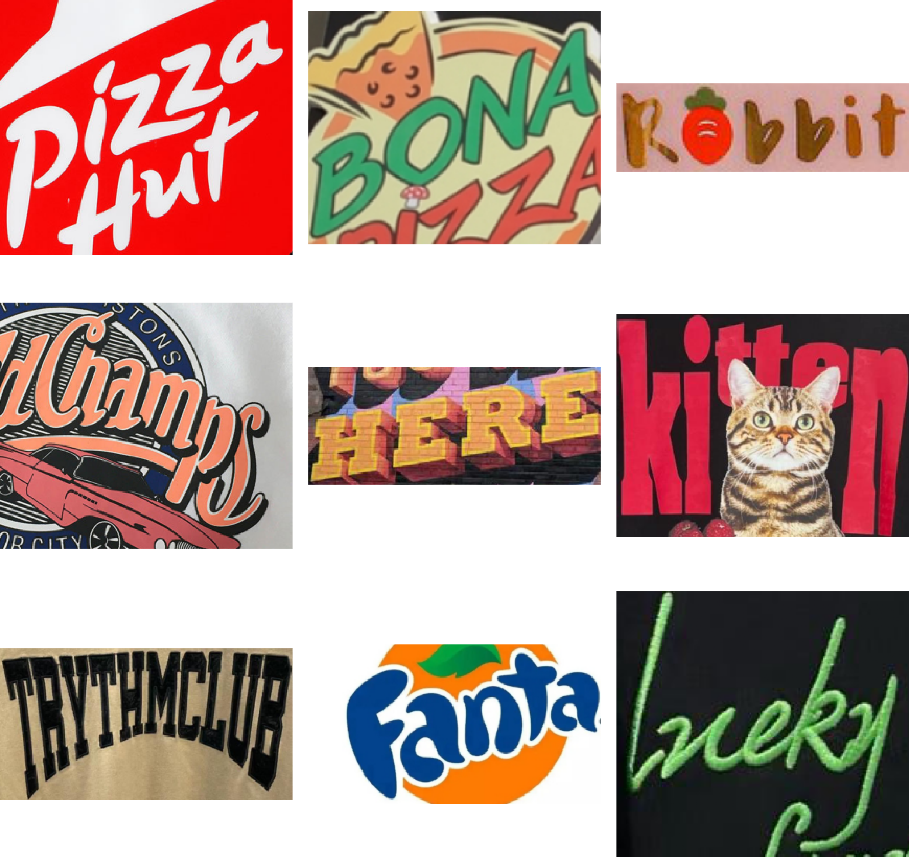

# Confidence-Aware Ensemble and Long-Word Refinement for Artistic Text Recognition

*Evaluating State-of-the-Art Approaches to Artistic Text Recognition*

**ICDAR 2024 Competition on Artistic Text Recognition**

Supervised by Prof. [Rayson Laroca](https://github.com/raysonlaroca).

<picture>
    <source
        srcset="https://raw.githubusercontent.com/lucas-azdias/PUCPR-SVG/ea4f6a6f371fa7c4b26b84b4ad8e00db2b830b9b/branco/pucpr-completa.svg"
        media="(prefers-color-scheme: dark)"
        height="80px"
    />
    <source
        srcset="https://raw.githubusercontent.com/lucas-azdias/PUCPR-SVG/ea4f6a6f371fa7c4b26b84b4ad8e00db2b830b9b/cor-primaria/pucpr-completa.svg"
        media="(prefers-color-scheme: light), (prefers-color-scheme: no-preference)"
        height="80px"
    />
    
</picture>

---

**[Models](#models)**
•
**[Dataset](#dataset)**
•
**[Getting started](#getting-started)**
•
**[Artifacts](#artifacts)**
•
**[Paper](manuscripts/Paper.pdf)**

<picture>
    <kbd>
        
    </kbd>
</picture>

---

## Team

- Lucas Azevedo Dias
- Henrique Anderle Schulz
- Rafaela de Miranda
- Guilherme Henrique Eduardo de Lara Peres
- Pedro Lucas Ghezzi Bittencourt

## Overview

The article addresses the challenge of Artistic Text Recognition (ATR), a complex field within computer vision that aims to interpret highly stylized text — characterized by distortions, variations in color, shape, and typography — commonly found in posters, covers, and other visual designs.

**The main goal of this work is to explore the current state of the art in ATR and to develop a customized, competitive solution** comparable to those presented at the **ICDAR 2024** competition, contributing to the advancement of text recognition techniques in artistic contexts.

Experiments conducted on Google Colab with an L4 GPU demonstrated that the proposed approach achieved **89.90% accuracy (WRA)** on the final test set of the **WordArt-V1.5** dataset, a performance that would place it among the top three solutions in the **ICDAR 2024** competition.

## ICDAR 2024

Based on the official results of the [ICDAR 2024](https://sites.google.com/view/icdar-2024-competition-wordart/) available [here](https://codalab.lisn.upsaclay.fr/competitions/17182#results), it is possible to directly compare the performance of the proposed solution with that of the final participants.

The official leaderboard reports the following results:

| # | Team | WRA (%) |
|:--:|:--|:--:|
| 1 | Ocr For WordArt | 91,07 |
| 2 | ViettelAI-OCR | 90,77 |
| 3 | Let Me See | 89,77 |
| 4 | iPad_OCR | 89,27 |

With a **WRA of 89.90%**, the **proposed method would have ranked 3rd in the competition** had it participated.

## Dataset

    <picture>
        <kbd>
            
        </kbd>
    </picture>

 

The **WordArt-V1.5** dataset provided by the competition was compiled and used for training, validating, and testing the models.

| Dataset | Description | Link |
|:--:|:--|:--:|
| **Compiled** | Consolidated version of WordArt-V1.5, including all images and annotations. | [GitHub](https://github.com/lucas-azdias/WordArt-V1.5-Dataset) |
| **Train** | Set used for training the models. | [Download](https://drive.google.com/file/d/1Lq6xKNbD7Kvs-i1myJPmwBLLG5YnoM9N/view) |
| **Test A (Validation)** | Subset intended for validation and hyperparameter tuning. | [Download](https://drive.google.com/file/d/15tkLbdXYzIILVWIg4kqjPMJ51p-vD2Ej/view) |
| **Test B (Competition)** | Final test set, used for official evaluation in the competition. | [Download](https://drive.google.com/file/d/1Q7kAqFITGntZAn-HuCh8vQpHTpDkPSAH/view) |

## Models

The models below were selected for the fusion stage because they feature state-of-the-art architectures and demonstrate excellent performance and generalization results on the **WordArt-V1.5** dataset.

In particular, they were selected because they cover different text recognition paradigms — Vision Transformer (ViT) based approaches with a vision-language decoder (**PARSeq**), Connectionist Temporal Classification (CTC) utilizing modules (**SVTRv2**), and self-supervised pre-training with a masked autoencoder (**MAERec**). This diversity fosters the complementarity of predictions during the fusion stage.

| Model | Source code | Published paper |
|:--:|:--:|:--:|
| **PARSeq** | [GitHub](https://github.com/baudm/parseq) | [ArXiv](https://arxiv.org/pdf/2207.06966) |
| **SVTRv2** | [GitHub](https://github.com/Topdu/OpenOCR/blob/main/configs/rec/svtrv2/readme.md) | [ArXiv](https://arxiv.org/pdf/2411.15858) |
| **MAERec** | [GitHub](https://github.com/Mountchicken/Union14M/tree/main?tab=readme-ov-file#5-maerec) | [ArXiv](https://arxiv.org/pdf/2307.08723) |

The fine-tuned model weights are available [here](https://mega.nz/folder/JZIyma4I#VbFauSW6ilS7n0ON9A3PQA).

## Other models

Other text recognition models were evaluated during the preliminary experiments. However, they were discarded for the final fusion stage due to low prediction complementarity, thereby failing to contribute significantly to the performance gain of the ensemble.

| Model | Source code | Published paper |
|:--:|:--:|:--:|
| **ViTSTR** | [GitHub](https://github.com/kwon-evan/ViTSTR) | [ArXiv](https://arxiv.org/pdf/2105.08582) |
| **CornerTransformer** | [GitHub](https://github.com/xdxie/WordArt) | [ArXiv](https://arxiv.org/pdf/2208.00438) |

## Artifacts

In the [`artifacts`](artifacts) folder, it is possible to find the following files:

| File | Description |
|:--:|:--|
| [**`Ensemble.ipynb`**](artifacts/Ensemble.ipynb) | Jupyter notebook created in Google Colab, containing the main execution of the ensemble and its models. |
| [**`errors_testB.csv`**](artifacts/erros_testeB.csv) | CSV file containing the classification of ensemble errors on Test B. |
| [**`output.zip`**](artifacts/output.zip) | Compressed archive containing the outputs generated by the notebook. It includes the results from the models and the ensemble for Test B, and the executions of the individual models on Test A can be found within the `models` folder. |
| [**`models`**](artifacts/models) | This folder contains the notebooks for the execution, evaluation, and fine-tuning of the evaluated models, where applicable. It includes the files: [`CornerTransformer.ipynb`](artifacts/models/CornerTransformer.ipynb), [`MAERec.ipynb`](artifacts/models/MAERec.ipynb), [`PARSeq.ipynb`](artifacts/models/PARSeq.ipynb), [`SVTRv2.ipynb`](artifacts/models/SVTRv2.ipynb) and [`ViTSTR.ipynb`](artifacts/models/ViTSTR.ipynb). |

## Manuscripts

In the [`manuscripts`](manuscripts) folder, it is possible to find the following texts:

| File | Description |
|:--:|:--|
| [**`Paper.pdf`**](manuscripts/Paper.pdf) | Final article drafted, covering the entire project development and its results. |

## Getting started

1. Open the [`Ensemble.ipynb`](artifacts/Ensemble.ipynb) notebook and run all the cells.
2. In the execution section, it is possible to find (i) the execution of the pre-trained models, (ii) the execution of the ensemble, (iii) the analysis of ensemble errors, and (iv) the ablation test performed.

---

    <picture>
        <source
            srcset="https://raw.githubusercontent.com/lucas-azdias/PUCPR-SVG/ea4f6a6f371fa7c4b26b84b4ad8e00db2b830b9b/branco/pucpr-simbolo.svg"
            media="(prefers-color-scheme: dark)"
            height="30px"
        />
        <source
            srcset="https://raw.githubusercontent.com/lucas-azdias/PUCPR-SVG/ea4f6a6f371fa7c4b26b84b4ad8e00db2b830b9b/cor-primaria/pucpr-simbolo.svg"
            media="(prefers-color-scheme: light), (prefers-color-scheme: no-preference)"
            height="30px"
        />
        
    </picture>

